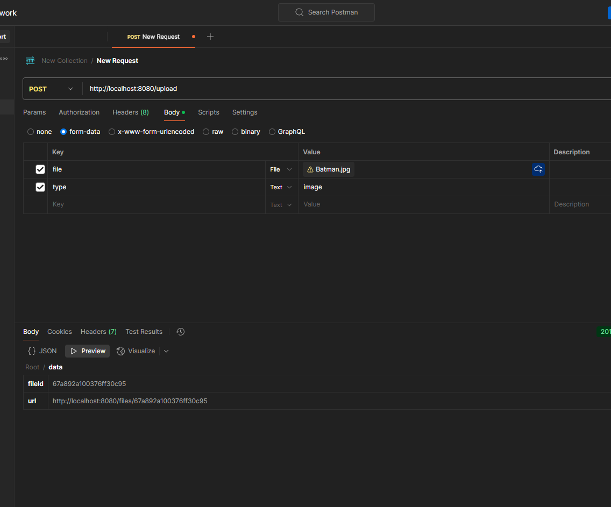
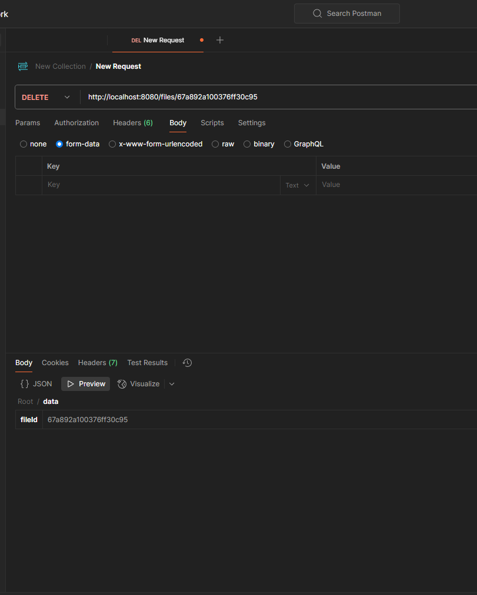

# HOW TO RUN 
just run 
> git clone https://github.com/Adarsh-rakshit/Simplotel-assignment

>npm install

>npm run dev

# API TEST RESULTS

- ## UPLOAD RESULTS
    

- ## DELETE FILE RESULTS
    

- ## FILE RETRIEVAL RESULTS
    